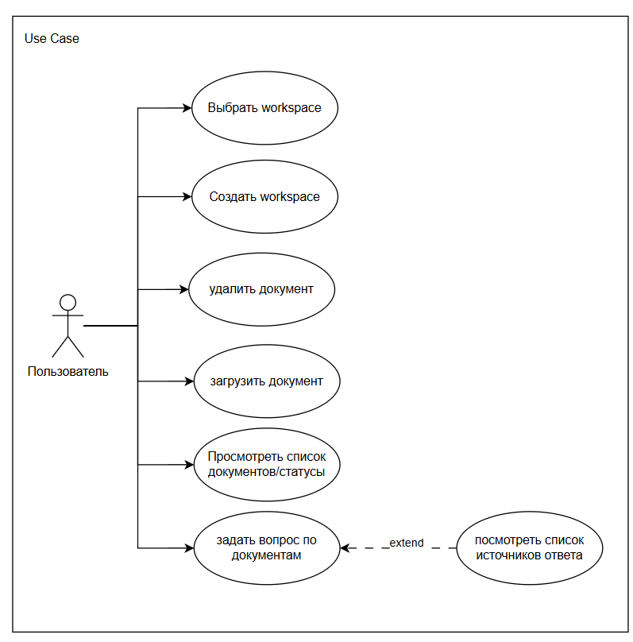

Система: Local LLM Copilot 

Актор: Пользователь 

Триггер: пользователь инициирует действия через UI.

Предусловие для большинства UC: пользователь выбрал workspace (или используется Default).

Данные: документы физически хранятся локально, метаданные и chunks — в PostgreSQL+pgvector.

Интеграции: Ollama (embeddings + LLM).

Бизнес-правило: ответы должны формироваться на основе найденных фрагментов; при отсутствии релевантных фрагментов система сообщает, что ответ не найден в загруженных документах.

# Задать вопрос по документам

Цель: получить ответ на вопрос на основе документов выбранного workspace.

Primary Actor: Пользователь.

Trigger: пользователь отправляет вопрос в чат.

### Предусловие:
Выбран workspace.

В workspace есть хотя бы 1 документ в статусе READY (иначе — альтернативный поток A1).

Интеграция с Ollama доступна (иначе — A3).

### Main Flow (Basic Path):
1. Пользователь вводит вопрос и нажимает "отправить".
2. Система фиксирует запрос и параметры.
3. Система получает embedding вопроса.
4. Система выполняет поиск релевантных фрагментов текста в загруженных документах.
5. Система формирует prompt (system rules + context chunks + question).
6. Система запрашивает генерацию ответа у LLM (Ollama).
7. Система возвращает пользователю: answer (текст ответа), sources[] (3–6 источников).
8. UI отображает ответ в чате.

### Postconditions (Success):

Пользователь видит ответ.

Источники доступны для просмотра.

### Alternative:

#### A1: Нет готовых документов (READY)

Система возвращает сообщение "Нет подходящих документов в workspace".
sources=[].

#### A2: Нет релевантных chunks

Система возвращает “В загруженных документах не найдено данных для ответа”.
sources=[].

#### A3: Ollama недоступна / таймаут

Система возвращает ошибку "LLM service unavailable".

#### A4: LLM вернул ответ без опоры на контекст

### Нефункциональные требования:

Ответ должен ссылаться на источники; источники формируются только из retrieval результатов.
Время ответа: < 1 сек (целевое), генерация зависит от модели.

# Просмотреть список источников ответа

<<extend>> к "Задать вопрос"
Цель: показать пользователю, на каких фрагментах документов основан ответ.

Trigger: пользователь открывает панель "Источники".

### Preconditions:

Выполнен UC "Задать вопрос" и получен sources[].

### Main Flow:

1. Пользователь открывает список источников.
2. Система отображает список элементов источников: документ (filename), страница (если известна), snippet (фрагмент текста).
4. Пользователь может выбрать источник, чтобы увидеть расширенный snippet.

### Postconditions:

Пользователь может проверить обоснованность ответа.

### Exceptions:

Источники отсутствуют (sources=[]) -> UI показывает "Источники не найдены".

# Загрузить документ

Цель: добавить документ в workspace и проиндексировать его для RAG.

Trigger: пользователь выбирает файл и подтверждает загрузку.

### Preconditions:

Выбран workspace.

Формат файла поддерживается (txt/md/pdf) (иначе A1).

### Main Flow:

1. Пользователь загружает файл.
2. Система сохраняет файл в storage (локальная FS).
3. Система создаёт Document со статусом UPLOADED, затем переводит в PROCESSING.
4. Система выполняет pipeline: parse -> chunk -> embeddings -> save chunks.
5. Система переводит документ в READY.
6. UI обновляет статус документа в списке.

### Postconditions:

Документ доступен для retrieval.
В БД есть chunks + embeddings.

### Alternative:

#### A1: Неподдерживаемый формат

Система отклоняет загрузку, статус не создаётся.

#### A2: Ошибка парсинга / пустой текст

Статус документа -> FAILED, error_message заполнен.

#### A3: Ошибка embeddings (Ollama)

Статус документа -> FAILED.

#### A4: Ошибка сохранения chunks

Статус документа -> FAILED

# Просмотреть список документов/статусы

Цель: видеть перечень документов и состояние индексации.

### Main Flow: система возвращает список документов с полями: filename, status, created_at.

Статусы: UPLOADED, PROCESSING, READY, FAILED    

# Удалить документ

Цель: убрать документ из системы и исключить его из retrieval.

### Main Flow:

1. Пользователь выбирает документ -> Delete
2. Система удаляет chunks
3. Система удаляет файл из storage
4. Система помечает DELETED запись документа
